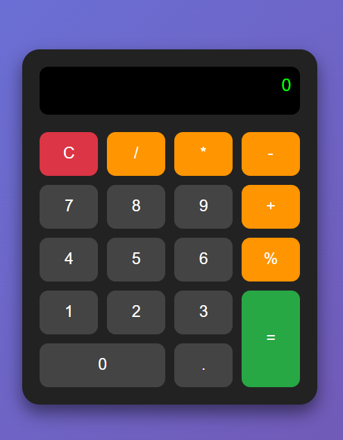

# 🧮 Simple Calculator Web App

A clean and responsive calculator built using **HTML, CSS, and JavaScript**.
It supports basic arithmetic operations with a modern UI design.

---

## 🚀 Features

* Basic operations: ➕ Addition, ➖ Subtraction, ✖️ Multiplication, ➗ Division
* Percentage (%) support
* Clear button (C)
* Error handling for invalid expressions
* Responsive and minimal UI

---

## 📸 Screenshot




---

## 🛠️ Tech Stack

* HTML5
* CSS3 (Grid + Styling)
* JavaScript (DOM Manipulation + Logic)

---

## 📂 Project Structure

```
📁 calculator-project
│── index.html
│── style.css
│── script.js
│── assets/
    └── screenshot.png
```

---

## ⚙️ How to Run

1. Clone the repository:

   ```bash
   git clone https://github.com/your-username/your-repo-name.git
   ```

2. Open the project folder

3. Run `index.html` in your browser

---

## 💡 How It Works

* User inputs are displayed dynamically
* Values are appended using JavaScript
* `eval()` is used to calculate expressions
* Errors are handled using try-catch

---

## ⚠️ Note

This project uses `eval()` for simplicity.
For production-level apps, consider safer alternatives.

---

## 📌 Future Improvements

* Add keyboard support
* Add scientific calculator features
* Improve UI animations
* Replace `eval()` with custom parser

---

## 🙌 Author

### Satyam kumar
  GitHub: https://github.com/satyamkr-05
